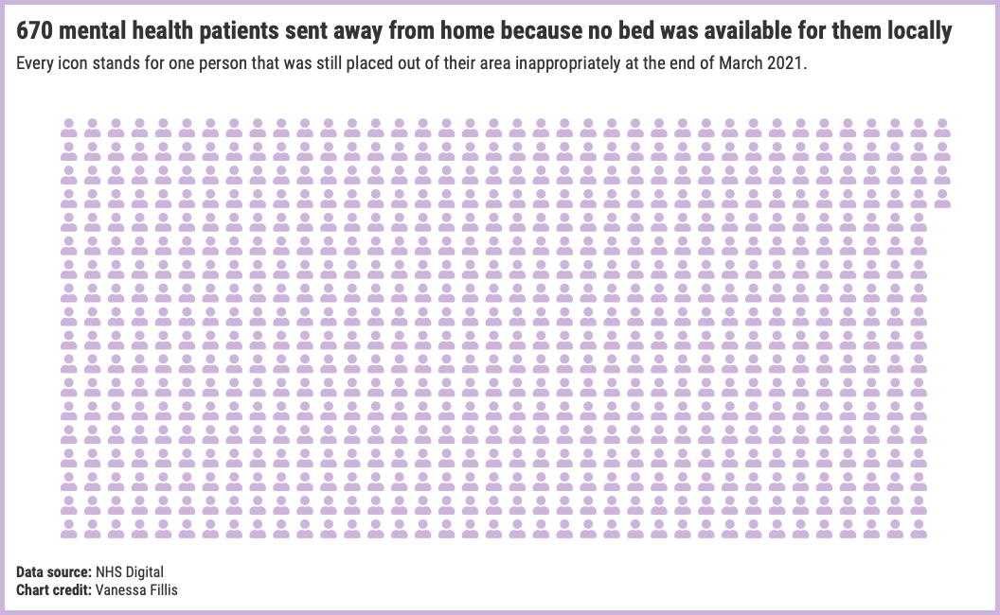
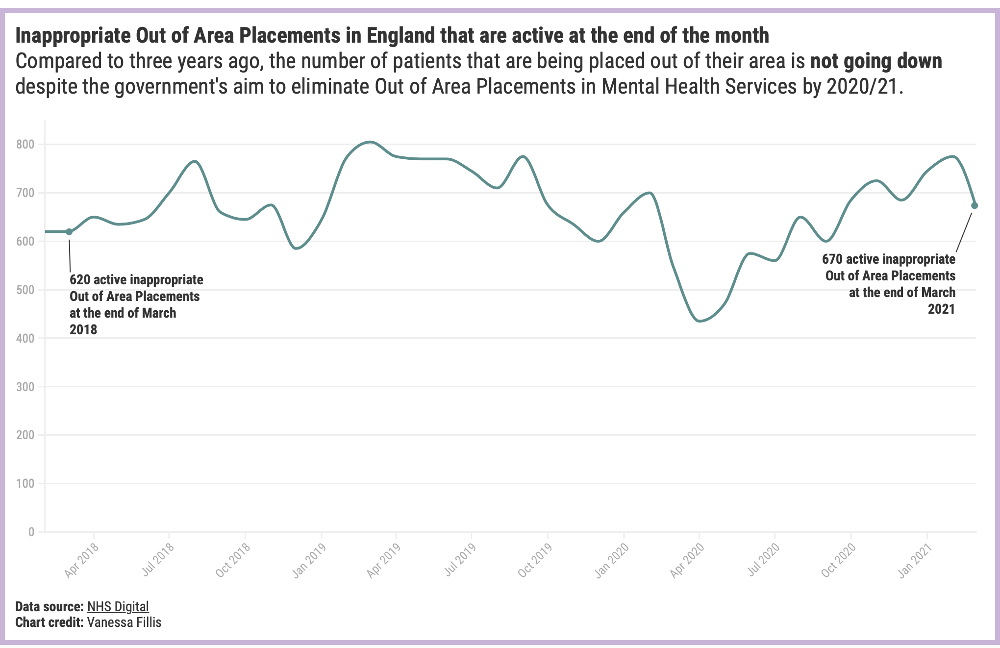

# Inappropriate Out of Area Placements in mental health services

Published: [Newsletter June 29](https://mailchi.mp/ea478d43d31d/5-minutes-against-stigma-1) & [Instagram June 21](https://www.instagram.com/p/CQYl4wKjqc1/)  
Data source: 

**670 mental health patients** were still placed in hospitals away from their home at the end of March 2021. They were sent out of their usual area for mental health treatment because no bed was available for them locally. 

While the UK Government has promised to eliminate inappropriate OAPs by the end of March 2021, the number is only slowly decreasing. In February 2021, inappropriate OAPs have reached their highest point 📈 since September 2019. 

Being forced to travel hundred of miles from home for mental health treatment can worsen chances of recovery, says Geoff Heyes, Head of Health Policy and Influencing at the charity Mind:

“When you’re experiencing a mental health crisis, you’re likely to feel scared, vulnerable and alone, so your support network of family and friends are instrumental to recovery. The negative impact that being far from home can have on your mental health cannot be overstated, and can even increase the risk of suicide.

“The UK Government promised to end inappropriate out of area placements by April 2021 but it’s clear it will miss this target. Given the damage this practice can have on people needing mental health support, they must redouble their efforts to meet this commitment as soon as possible.”

A spokesperson for NHS England said: "The NHS remain committed to eliminating adult acute out of area placements as soon as possible, whilst ensuring it is done in a way that does not compromise patient safety."

