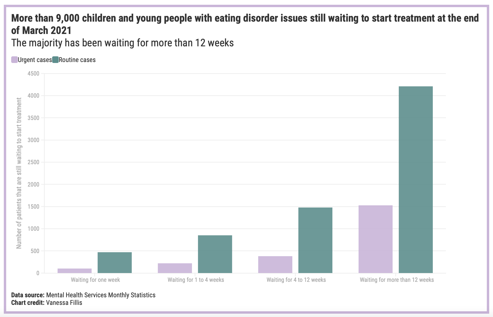
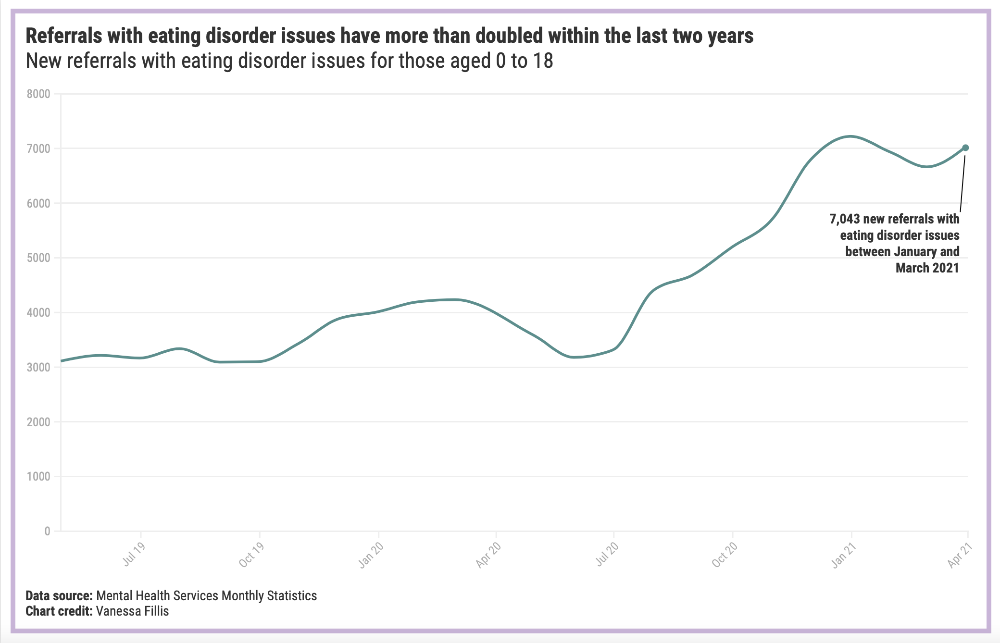

# Waiting times / eating disorder referrals 

Published: [Instagram 2 July](https://www.instagram.com/p/CQ0he7Gj9AC/)
 Data source: 

**More than 9,000 children and young people** who have been referred to mental health services for eating disorder issues were **still waiting** to start treatment at the end of March. 62% of those aged 0 to 18 were already waiting for **over 12 weeks**. 

Added to already long waiting times, the number of new referrals with eating disorder issues has **doubled** within the last two years. Between January and March 2021, there were 7,043 new referrals — compared to 3,111 in the same period two years before. 

[The Access and Waiting Time Standard for Children and Young People with an Eating Disorder](https://www.england.nhs.uk/wp-content/uploads/2015/07/cyp-eating-disorders-access-waiting-time-standard-comm-guid.pdf) states that **95%** of those referred for assessment or treatment for an eating disorder should receive NICE-approved treatment within one week in urgent cases, and four weeks in routine cases.Latest data by NHS Digital reveals that only 46% of urgent and 52% of routine referrals have started treatment within the recommended time frames. 

