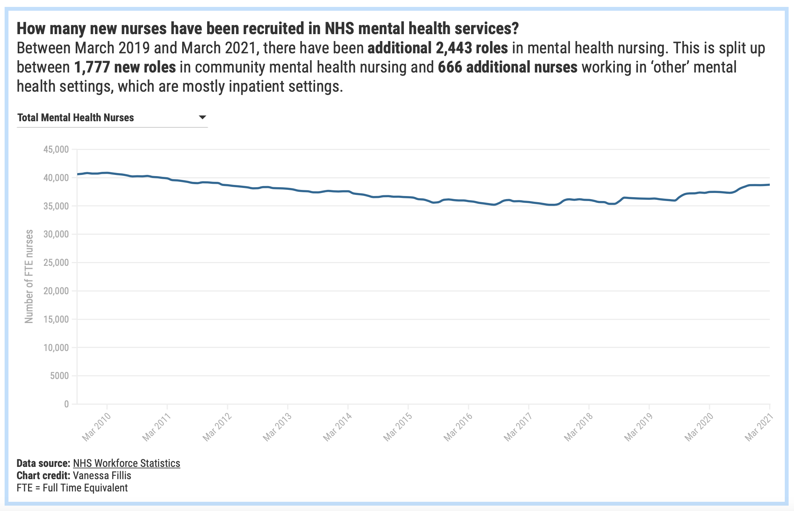
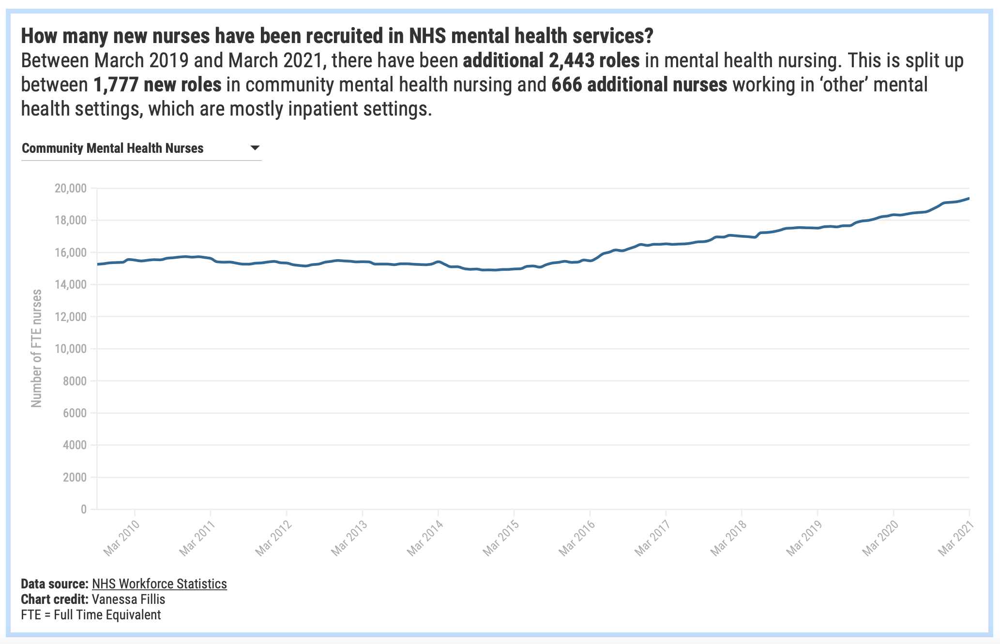

# Recruitment of mental health nurses

Published: [Newsletter 15 July](https://mailchi.mp/22ffe8ad992c/5-minutes-against-stigma-5254829?e=[UNIQID])
 Data source: [Mental Health Services Monthly Statistics](https://digital.nhs.uk/data-and-information/publications/statistical/mental-health-services-monthly-statistics)

The number of nurses in mental health services is increasing, latest data by NHS Digital reveals. 

This is in line with national strategies for expanding the mental health workforce. In 2019, the [Mental Health Implementation Plan](https://www.longtermplan.nhs.uk/wp-content/uploads/2019/07/nhs-mental-health-implementation-plan-2019-20-2023-24.pdf) outlined that 27,640 more mental health staff would be needed by 2023/24 to achieve the ambition of delivering evidence-based services to an additional 2 million people. This is additional to the planned workforce increase that has been promised in [Stepping forward to 2020/21: The mental health workforce plan for England](https://www.hee.nhs.uk/sites/default/files/documents/Stepping%20forward%20to%20202021%20-%20The%20mental%20health%20workforce%20plan%20for%20england.pdf).

4,220 of the new roles by 2023/24 are planned for nursing. Data for mental health nurses between March 2019 and March 2021 shows an increase by **2,443 new nursing roles**. 

**Over two thirds** of these nurses have been recruited for community services.

But, the most recent published vacancy rates for England suggest that that every tenth mental health nursing position is unfilled.

