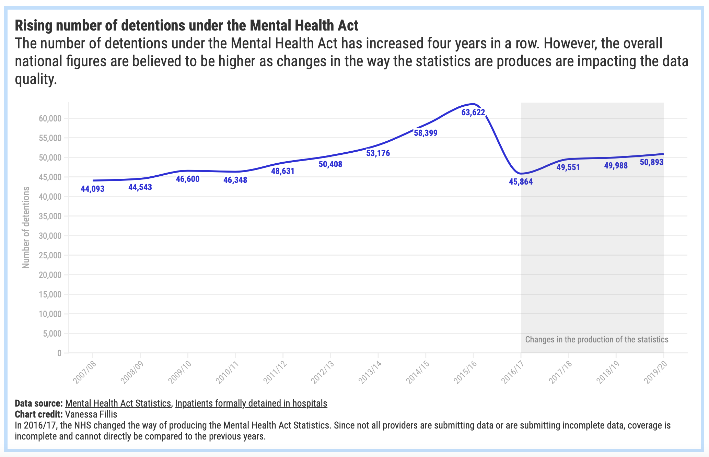
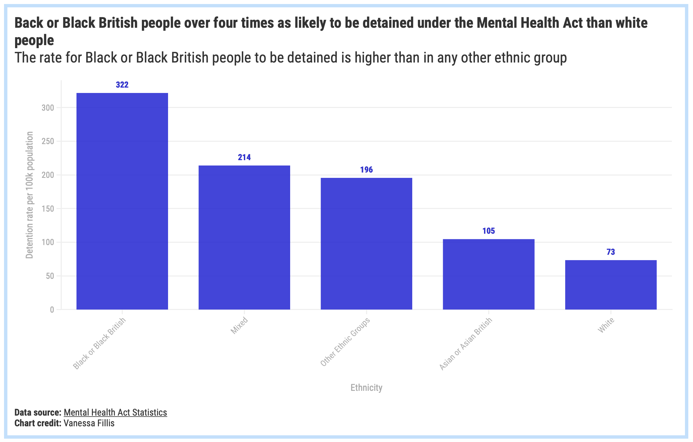

# Detentions under the Mental Health Act

Published: [Newsletter 23 July](https://mailchi.mp/ae1dc36da04d/5-minutes-against-stigma-5257629?e=[UNIQID])
 Data source: [Mental Health Act Statistics](https://digital.nhs.uk/data-and-information/publications/statistical/mental-health-act-statistics-annual-figures/2019-20-annual-figures) & [Inpatients formally detained in hospital](https://digital.nhs.uk/data-and-information/publications/statistical/inpatients-formally-detained-in-hospitals-under-the-mental-health-act-1983-and-patients-subject-to-supervised-community-treatment)

The number of detentions under the Mental Health Act has been rising since the Act was last amended in 2007, data by NHS Digital reveals.

Between April 2019 and March 2020, **50,893 new detentions** under the Mental Health Act were recorded.

However, the overall national total is **believed to be higher**.

In 2016/17, the NHS changed the way of producing the Mental Health Act Statistics. This change has had a profound impact on the quality of data and on understanding how the Mental Health Act is being used, [says Veena Raleigh, senior fellow, policy at The King’s Fund](https://www.kingsfund.org.uk/blog/2017/12/mental-health-act-data).

Since not all providers are submitting data or are submitting incomplete data, coverage is incomplete. While 172 organisations have submitted data about the Mental Health Act in 2015/16, the number fell to 104 in 2019/20.

This is one of the reasons why campaigners have been calling for a reform to the Mental Health Act for years. 

Furthermore, people from Black and Black British groups are **more likely to be detained**. Data from 2019/20 shows that the rate for Black or Black British people to be detained is higher than in any other ethnic group.

In their report *[Monitoring the Mental Health Act in 2018/19]*(https://webarchive.nationalarchives.gov.uk/20200516222734/https://www.cqc.org.uk/publications/major-report/monitoring-mental-health-act-201819) the **Care Quality Commission** said: "The overrepresentation of some Black and minority ethnic (BME) groups who are detained under the MHA continues to be a particular cause for concern."

