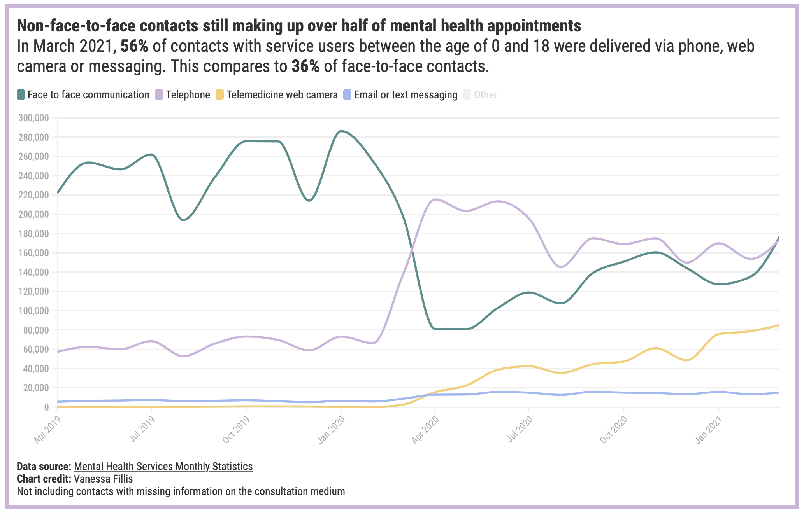

# Mental Health contacts by consultation medium

Published: [Instagram 12 August](https://www.instagram.com/p/CSebra-Dr31/) & [Newsletter 9 August](https://mailchi.mp/540e43083ba4/5-minutes-against-stigma-5260857?e=[UNIQID])
 Data source: [Mental Health Services Monthly Statistics](https://digital.nhs.uk/data-and-information/publications/statistical/mental-health-services-monthly-statistics)

Non-face-to-face contacts in mental health services are still making up **over half of all attended appointments** for service users between the ages of 0 to 18. 

In March 2021, 56% of contacts were delivered via phone, web camera or messaging. This compares to 36% of contacts taking place in person.

Before the pandemic, more than two-thirds of contacts were face-to-face with only one in five delivered non face-to-face.

When the pandemic hit, the consultation medium changed. While face-to-face appointments dropped, the phone, web camera and messaging services increasingly became the new normal. 

In recent months, the data shows a **slight return to face-to-face contacts**. For the first time since the start of the pandemic, the number of face-to-face contacts has overtaken phone contacts in March 2021.

